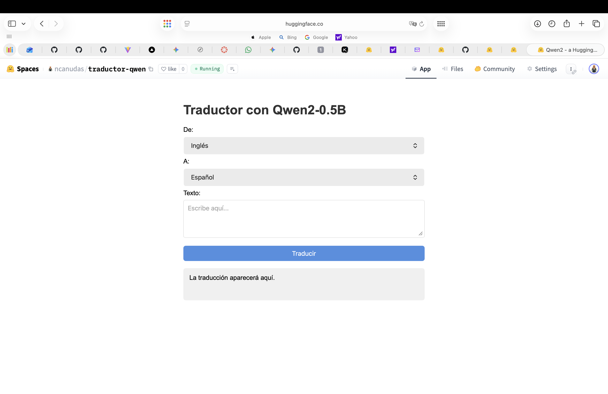

# Traductor con Qwen2-0.5B

App de traducción usando el modelo [Qwen2-0.5B-Instruct](https://huggingface.co/Qwen/Qwen2-0.5B-Instruct). No requiere API keys. Disponible en línea en [Hugging Face Spaces](https://huggingface.co/spaces/ncanudas/traductor-qwen).



## Instalación

```bash
pip install -r requirements.txt
```

## Uso

```bash
python app.py
```

Abre el navegador en `http://localhost:7860`.

## Ejemplos incluidos

| Texto | Origen | Destino |
|---|---|---|
| I like soccer | English | Spanish |
| How are you? | English | Spanish |
| What time is it? | English | Spanish |

## Idiomas soportados

English, Spanish, French.
